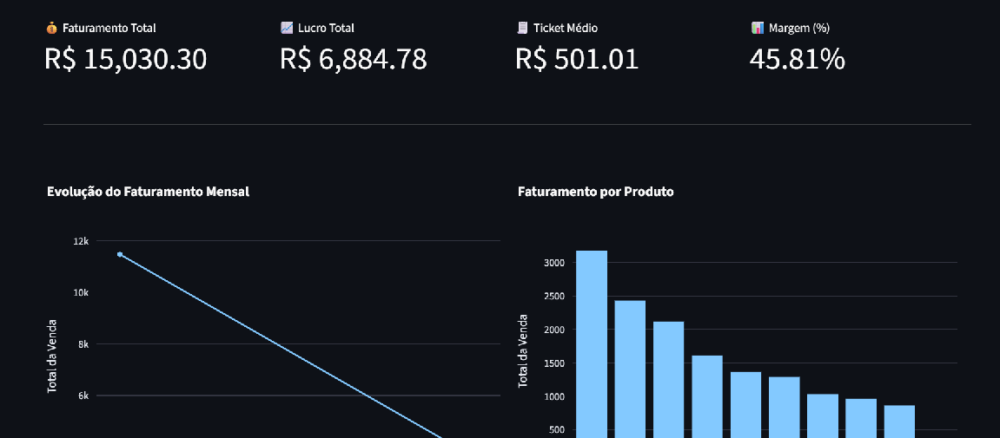
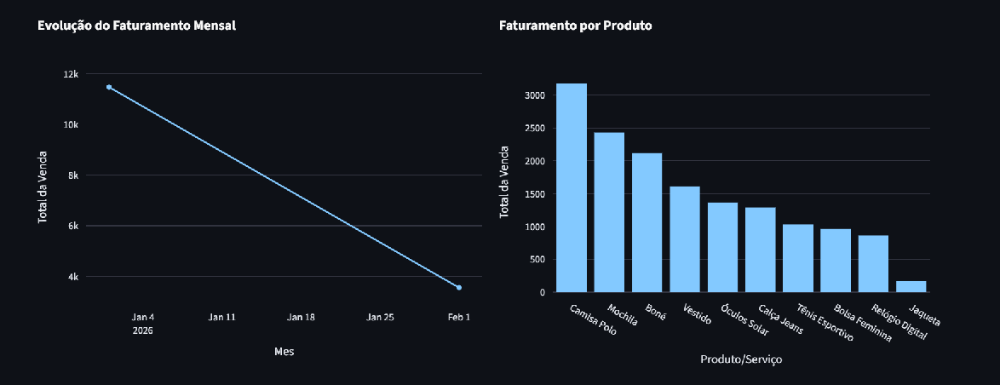
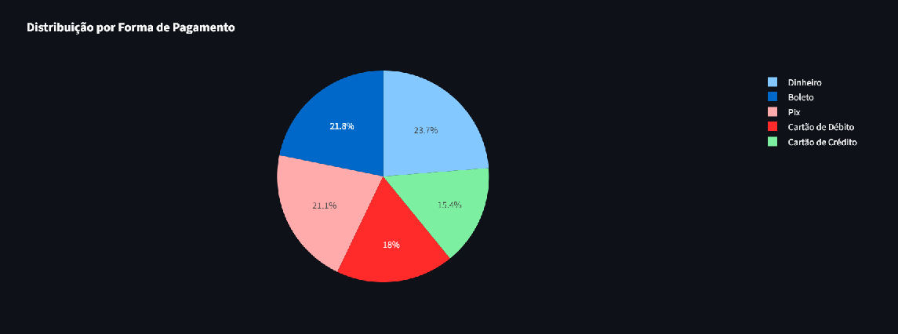
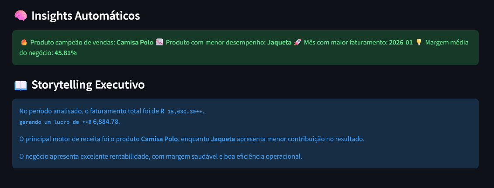

<h1 align="center">📊 Dashboard de Vendas Inteligente</h1>

Aplicação de Business Intelligence desenvolvida em Python para transformar planilhas de vendas em dashboards executivos com insights automáticos.

  
  
  
  

---

<h2>🚀 Sobre o Projeto</h2>

Este projeto simula um cenário real de negócio onde dados brutos de vendas precisam ser transformados em informação estratégica.

A aplicação:

<ul>
<li>Recebe planilhas padronizadas de vendas</li>
<li>Realiza tratamento robusto de dados</li>
<li>Recalcula métricas no backend (não depende de fórmulas do Excel)</li>
<li>Gera KPIs estratégicos automaticamente</li>
<li>Produz dashboards interativos</li>
<li>Entrega insights automatizados</li>
<li>Cria storytelling executivo orientado à decisão</li>
</ul>

---

<h2>📊 Funcionalidades</h2>

✔ Upload de arquivo Excel  
✔ Download de template padronizado  
✔ Validação automática de estrutura  
✔ Tratamento de dados inconsistentes  
✔ Reprocessamento de métricas  
✔ KPIs estratégicos  
✔ Visualizações interativas  
✔ Insights automáticos  
✔ Narrativa executiva baseada em performance  

---

<h2>🧠 Arquitetura e Decisões Técnicas</h2>

<ul>
<li><strong>Data Validation:</strong> Verificação de colunas obrigatórias</li>
<li><strong>Data Cleaning:</strong> Conversão segura de datas e valores numéricos</li>
<li><strong>Reprocessamento de métricas:</strong> Cálculo de faturamento, custo e lucro no backend</li>
<li><strong>Prevenção de NaN:</strong> Proteção contra falhas em métricas</li>
<li><strong>Data Storytelling:</strong> Geração automática de insights interpretativos</li>
</ul>

O objetivo foi demonstrar capacidade analítica e pensamento orientado a produto de dados.

---

<h2>🛠 Stack Utilizada</h2>

<ul>
<li>Python</li>
<li>Streamlit</li>
<li>Pandas</li>
<li>Plotly</li>
<li>OpenPyXL</li>
</ul>

---

<h2>📁 Estrutura do Projeto</h2>

<pre>
dashboard_vendas_bi/
│
├── app.py
├── requirements.txt
├── README.md
|
└── .streamlit/
    └── config.toml
|
└── assets/
    └── screenshot_1.png
    └── screenshot_2.png
    └── screenshot_3.png
    └── screenshot_4.png
|
└── data
    └── Template_Controle_Vendas.xlsx
</pre>

---

<h2>▶️ Como Executar Localmente</h2>

<pre>
# Clone o repositório
git clone https://github.com/RenanCrvlho/dashboard_vendas_bi.git

# Entre na pasta
cd dashboard_vendas_bi

# Instale as dependências
pip install -r requirements.txt

# Execute a aplicação
streamlit run app.py
</pre>

---

<h2>📈 Demonstração</h2>

---

<h2>📬 Contato</h2>

LinkedIn: www.linkedin.com/in/renan-carvalho-354286210 
Email: rfac2000@hotmail.com  

 

Desenvolvido com foco em transformar dados em decisões.

